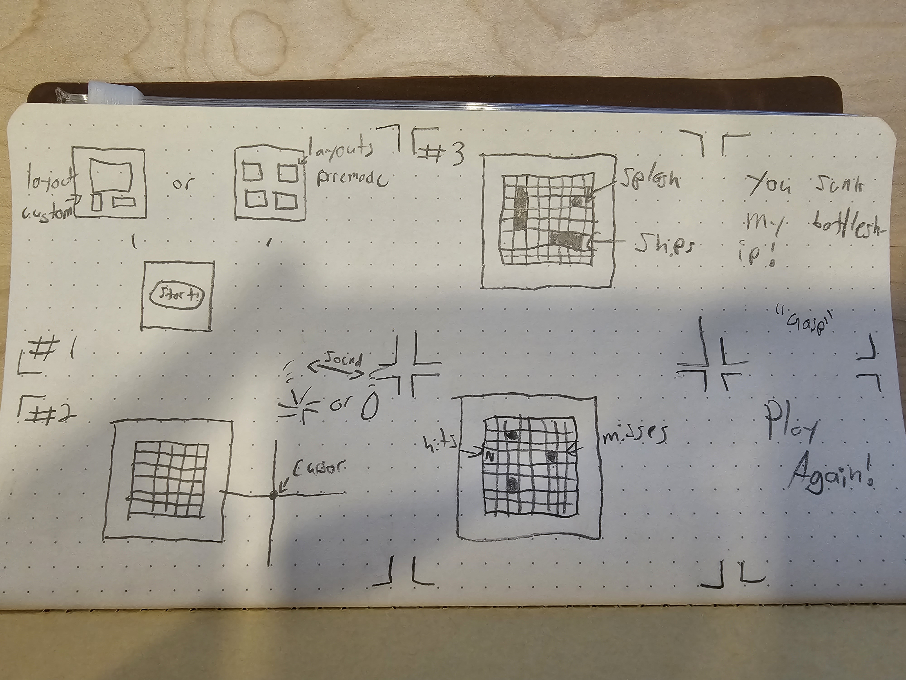

# Battleship

OVERVIEW

Battleship! This is a game where you systematically guess the location of your enimes ships, eventually sinking their fleet, or drowning with your own! 

Technologies used:

-HTML5
-CSS
-Javascript

As a user, I want the ability to... 
- Press play and have a board appear
- Choose a layout for my ships(Predetermined or custom) upon a grid
- Press start and have the game start
- Have an empty grid appear, indicating the enemy's board
- Click on an empty box and either see an explosion, or a splash, indicating success or failure
- Have the board containing my ships appear, and watch either a splash or an explosion of my ownships as the computer plays its turn
- Return to the enemys blank grid board, with a mark indicating my last move/moves, as to help the game progress
- Repeat this process until there is a winner

FUTURE UPDATES

- Figure out how to make a custom cursor at some point
- better boats!
- a different reload system?
